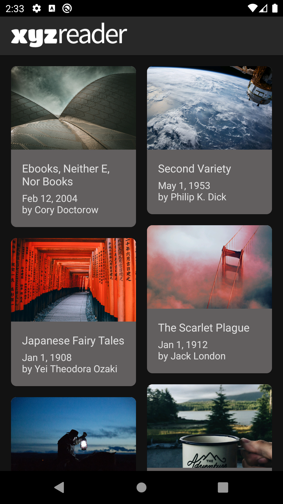
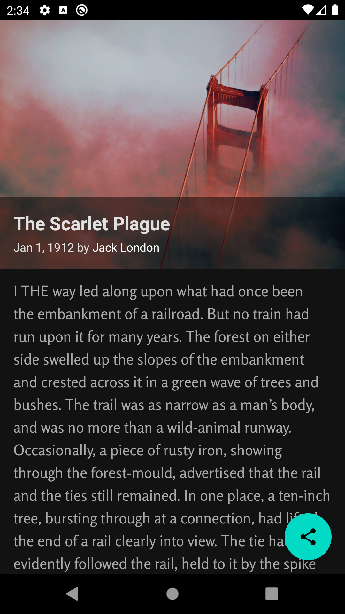
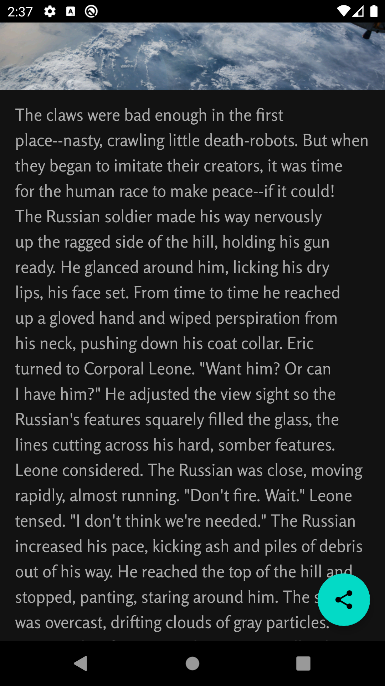
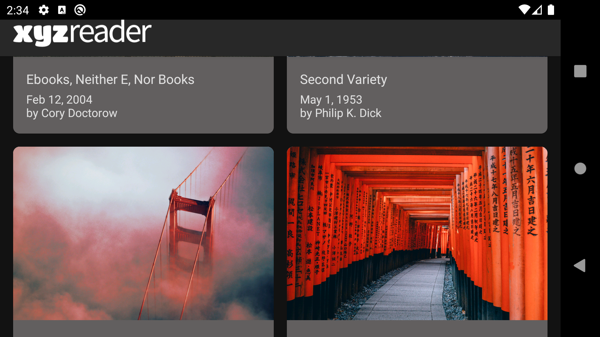
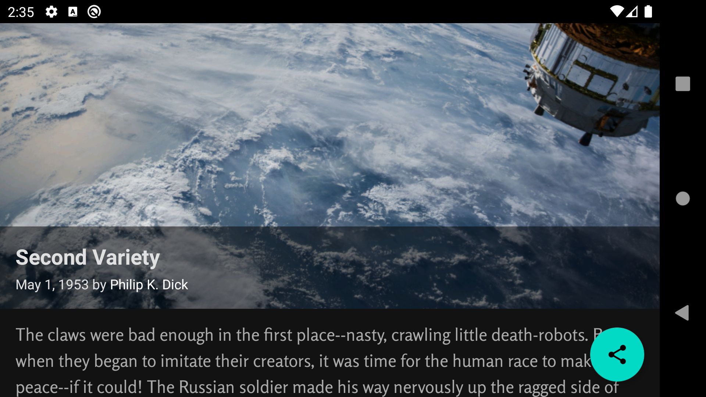

# Make-Your-App-material
Udacity | Android Developer Nanodegree | Project 6: XYZ Reader

### Project Overview:
In this project, you will redesign an app to follow the Material Design guidelines and translate a set of static design mocks to a living and breathing app.

### Why this Project?
This project gives you an opportunity to improve an app’s design, a vital skill for building apps users will love. It also replicates a common developer task of updating and changing an app's design as new standards are released.

### What Will I Learn?
Through this project, you will:

- Understand the fundamentals of Android design.
- Apply Material Design guidelines to a mobile application.
- Separate an interface into surfaces.
- Effectively use transitions and motion.

### Required Tasks:
- Download a zip file of the app.
- Read the UI Review in the next node.
- Spend time exploring the current state of the app, looking for ways it could be improved. The app will need multiple improvements. Be sure to look specifically at issues called out in the UI Review.
- Execute the improvements!

### Note:
1. This app was designed keeping in mind the dark theme feature available and makes use of Material dark theme system.
2. In order to check out the dark theme and color palette utilized and for the App to feel more expressive and less strain on eyes, please test on Android emulator running API level 29+
3. You can switch to Dark theme by going into Settings -> Display -> Dark theme (toggle button)

### Snapshots:

   

  
